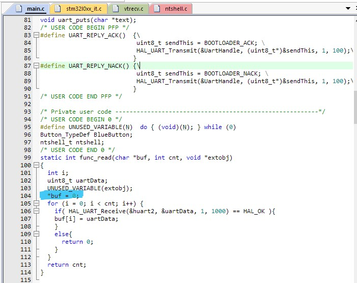
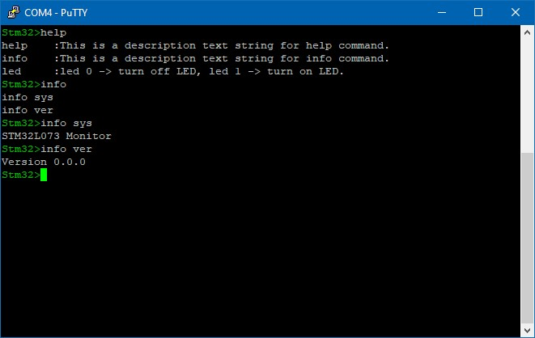

# Natural Tiny Shell 

## This is using NTShell with STM32L073 Nucleo board.

NTShell can be available from this link.
[NTShell](https://cubeatsystems.com/ntshell/api.html)

## UART2 Setting
```
BaudRate = 115200
Parity = No
Bits = 8
Stop Bit = 1
```

### *I have to add *buf = 0 in func_read().**


## Accessing NTShell via Putty
