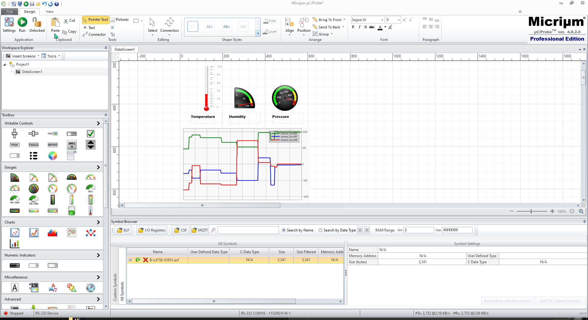

# uCprobe with RS-232 using B-L475E-IOT01A Board 
## This project is using USART1 which connected to onboard STLink
## USART1 Setting
```
BaudRate = 115200
Parity = No
Bits = 8
Stop Bit = 1
```

In the main.c the following two lines of code need to add.
```C
  ProbeRS232_InitTarget(115200); //Do Not Initialize UART Interrupt
  ProbeRS232_RxIntEn();	
```

At the UART Interrupt Handler, add the following code.
```C
void USART1_IRQHandler(void)
{
	CPU_INT08U      rx_data;
    if(((hDiscoUart.Instance->ISR & USART_ISR_TC) != RESET) && ((hDiscoUart.Instance->CR1 & USART_CR1_TCIE) != RESET))
	{
		ProbeRS232_TxHandler();
		SET_BIT(hDiscoUart.Instance->RQR, USART_RQR_TXFRQ ); //Clear TXE bit
	}
	else
	{
		rx_data = hDiscoUart.Instance->RDR & 0xFF; //Reading will auto clear RXNE flag
		ProbeRS232_RxHandler(rx_data);		
	}
	if((hDiscoUart.Instance->ISR & USART_ISR_ORE) != RESET)
	{
		//overrun err
		SET_BIT(hDiscoUart.Instance->ICR, USART_ICR_ORECF);
	} 
}
```

## uCProbe Running 
